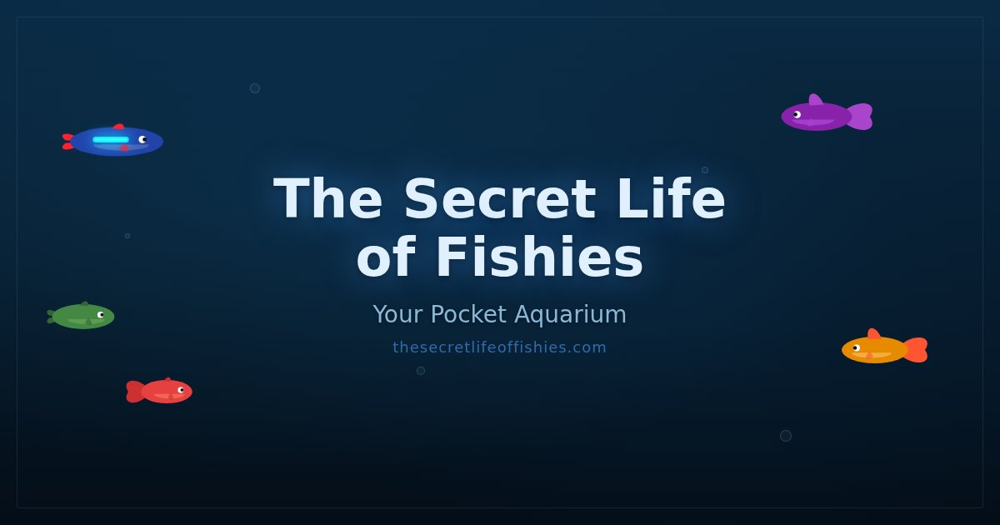
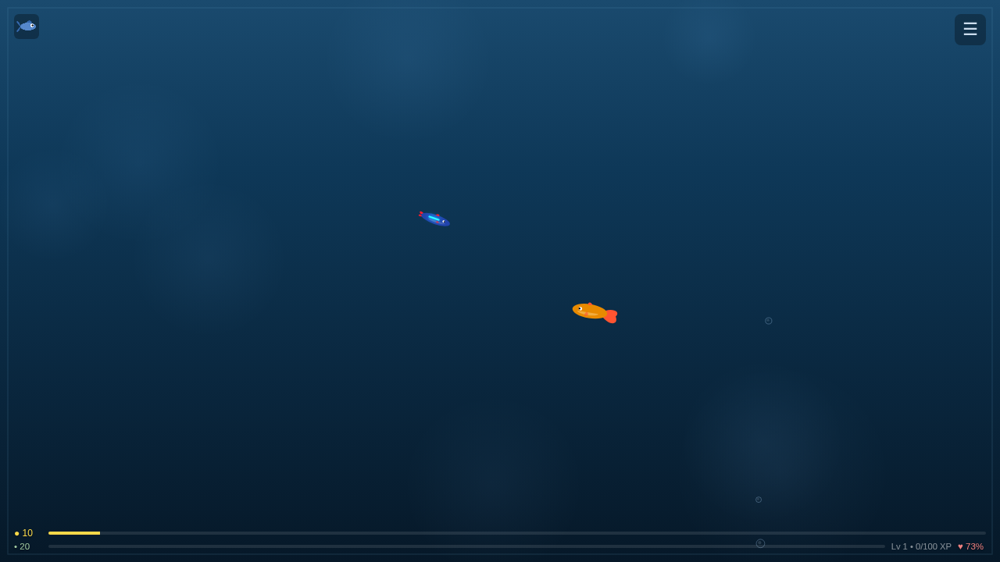

# The Secret Life of Fishies

**Your pocket aquarium.** A browser-based fish tank idle game where you feed, boop, and collect procedurally drawn fish -- all from your phone (or desktop). Tilt to peek from above, tap to drop food, and try not to let anyone swim away.

**Play now at [thesecretlifeoffishies.com](https://thesecretlifeoffishies.com)**

## Gameplay

## Features

- **Dual perspective** -- tilt your phone to smoothly crossfade between side view and top-down view
- **14 procedural fish species** -- Neon Tetras, Bettas, Angelfish, Discus, and more, all drawn with Canvas paths (zero image assets)
- **Fish AI** -- they wander, seek food, eat, follow your finger, and react to boops with sparkle effects
- **Real water chemistry** -- ammonia, nitrite, nitrate, bacteria, and algae follow a simplified nitrogen cycle that actually matters
- **Decorations** -- Java Ferns, Castle Ruins, Coral Reefs, LED String Lights, and more that affect gameplay (reduce algae, boost happiness, speed up bacteria)
- **Progression** -- earn XP and coins passively and through interactions, level up (7 levels) to unlock bigger tanks and new species
- **Fish store** -- buy fish, food packs, decorations, and care items like Water Conditioner and Algae Scrub
- **Fish happiness** -- a composite of hunger, strength, and water quality. Neglect them and they'll swim away
- **Share your tank** -- generate a shareable link so friends can see your aquarium
- **Offline catch-up** -- auto-saves to localStorage, calculates what happened while you were away
- **Installable PWA** -- add to home screen for a full-screen app experience

## How to Play

| Action | Mobile | Desktop |
|--------|--------|---------|
| Switch view | Tilt phone | Press **V** or **Space** |
| Feed | Tap water (top-down view) | Click water (top-down view) |
| Boop a fish | Tap fish (side view) | Click fish (side view) |
| Attract fish | Hold finger near them | Hold cursor near them |
| Inspect fish | Long-press a fish | Long-click a fish |
| Open menu | Tap the hamburger icon | Click the hamburger icon |

**Quick tips:**
- Happy fish generate coins over time. Interacting with them boosts coin generation 3x.
- Change water regularly to keep ammonia and nitrite low.
- Don't overfeed -- uneaten food decays and fouls the water.
- Fish that stay unhappy for too long will leave your tank.

## Tech Stack

- **Vanilla JavaScript** with ES modules -- no frameworks, no build step
- **HTML5 Canvas 2D** for all rendering (fish, water, decorations, effects, bubbles)
- **localStorage** for persistence
- **DeviceOrientation API** for tilt controls on mobile
- **Web Share API** for sharing tank snapshots
- Hosted as a static site, works on GitHub Pages over HTTPS
